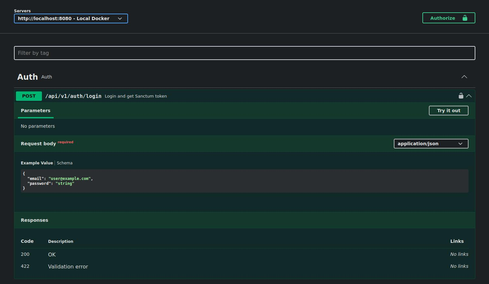

# TaskForge API

Production-like REST API backend for task and project management (simplified Jira / Linear / Trello).

## Status

- [x] Laravel 11 project initialized
- [x] Docker development stack (nginx + php-fpm + postgres + redis)
- [x] Auth via Laravel Sanctum (token-based)
- [x] API versioning: `/api/v1/...`

## Tech Stack

- PHP 8.3
- Laravel 11
- PostgreSQL
- Redis
- Docker (nginx + php-fpm)
- Laravel Sanctum
- PHPUnit
- OpenAPI / Swagger
- GitHub Actions

## Architecture

High-level layering:

- **HTTP layer**: Controllers + FormRequests + API Resources
- **Application layer**: Actions + DTOs (use-cases)
- **Domain layer**: Eloquent Models + Enums + Policies (RBAC)
- **Infrastructure**: PostgreSQL/Redis, Events/Listeners/Jobs, queues

Key decisions:

- Workspace-scoped routes: `/api/v1/workspaces/{workspace}/...`
- Policy-first authorization for RBAC (`owner/admin/member/viewer`)
- Activity Log as first-class feature (domain events -> activity records)

## API

Current endpoints:

- `POST /api/v1/auth/register`
- `POST /api/v1/auth/login`
- `GET  /api/v1/auth/me` (requires `auth:sanctum`)
- `POST /api/v1/auth/logout` (requires `auth:sanctum`)

Workspace-scoped endpoints (selected):

- `GET    /api/v1/workspaces`
- `POST   /api/v1/workspaces`
- `GET    /api/v1/workspaces/{workspace}`
- `PATCH  /api/v1/workspaces/{workspace}`
- `DELETE /api/v1/workspaces/{workspace}`

- `GET   /api/v1/workspaces/{workspace}/projects`
- `POST  /api/v1/workspaces/{workspace}/projects`
- `GET   /api/v1/workspaces/{workspace}/projects/{project}`

- `GET   /api/v1/workspaces/{workspace}/projects/{project}/tasks` (filtering/sorting/pagination)
- `POST  /api/v1/workspaces/{workspace}/projects/{project}/tasks`
- `PATCH /api/v1/workspaces/{workspace}/tasks/bulk`
- `GET   /api/v1/workspaces/{workspace}/tasks/{task}`

- `POST   /api/v1/workspaces/{workspace}/tasks/{task}/labels`
- `DELETE /api/v1/workspaces/{workspace}/tasks/{task}/labels/{label}`

- `GET   /api/v1/workspaces/{workspace}/tasks/{task}/comments`
- `POST  /api/v1/workspaces/{workspace}/tasks/{task}/comments`
- `PATCH /api/v1/workspaces/{workspace}/comments/{comment}`

- `GET   /api/v1/workspaces/{workspace}/members`
- `PATCH /api/v1/workspaces/{workspace}/members/{member}` (role change)

- `GET    /api/v1/workspaces/{workspace}/invitations`
- `POST   /api/v1/workspaces/{workspace}/invitations`
- `DELETE /api/v1/workspaces/{workspace}/invitations/{invitation}`
- `POST   /api/v1/invitations/{token}/accept`
- `POST   /api/v1/invitations/{token}/decline`

- `GET   /api/v1/workspaces/{workspace}/activity`

Swagger UI:

- `GET /api/docs`
- OpenAPI JSON: `GET /docs?api-docs.json`

## Getting Started

### Requirements

- Docker Engine + Docker Compose

### Setup

1. Create `.env` from `.env.example`.
2. Build and start containers:

   ```bash
   sudo docker compose up -d --build
   ```

3. Run migrations:

   ```bash
   sudo docker compose exec -T app php artisan migrate --force
   ```

4. Generate Swagger docs (optional):

   ```bash
   sudo docker compose exec -T app php artisan l5-swagger:generate
   ```

5. Open:

- API base URL: `http://localhost:8080/api/v1`
- Swagger UI: `http://localhost:8080/api/docs`

## Docker Setup

Services:

- `nginx` (port `8080`)
- `app` (PHP-FPM 8.3)
- `postgres` (port `5432`)
- `redis` (port `6379`)

## Tests

Run tests:

```bash
sudo docker compose exec -T app php artisan test
```

## Formatting (Pint)

Check code style:

```bash
./vendor/bin/pint --test
```

## CI (GitHub Actions)

Pipeline:

- Install dependencies (composer)
- Run Pint (style check)
- Run migrations
- Run tests (PHPUnit)

## Examples (curl)

Login:

```bash
curl -sS -X POST http://localhost:8080/api/v1/auth/login \
  -H 'Content-Type: application/json' \
  -d '{"email":"demo@example.com","password":"password"}'
```

Create workspace (replace `TOKEN`):

```bash
curl -sS -X POST http://localhost:8080/api/v1/workspaces \
  -H 'Authorization: Bearer TOKEN' \
  -H 'Content-Type: application/json' \
  -d '{"name":"My Workspace","slug":"my-workspace"}'
```

List tasks with filters:

```bash
curl -sS "http://localhost:8080/api/v1/workspaces/1/projects/1/tasks?status=todo&sort=-id&per_page=20" \
  -H 'Authorization: Bearer TOKEN'
```

Attach labels to task:

```bash
curl -sS -X POST http://localhost:8080/api/v1/workspaces/1/tasks/1/labels \
  -H 'Authorization: Bearer TOKEN' \
  -H 'Content-Type: application/json' \
  -d '{"label_ids":[1,2]}'
```

## Screenshots

Placeholders (will be added):

- Swagger UI
- Example API responses

### Swagger UI



## Roadmap

- [x] Project bootstrap (Laravel 11)
- [x] Docker environment (nginx + php-fpm + postgres + redis)
- [x] Sanctum auth (register/login/me/logout)
- [x] Domain model + migrations: Workspace, Project, Task, Comment, Label, Invitation, ActivityLog, WorkspaceMember
- [x] RBAC (Policies): `owner/admin/member/viewer`
- [x] REST endpoints: Workspaces, Projects, Tasks, Comments, Labels, Invitations, Activity
- [x] Activity Log system (events -> activity)
- [x] OpenAPI/Swagger
- [x] GitHub Actions CI
- [ ] README screenshots
